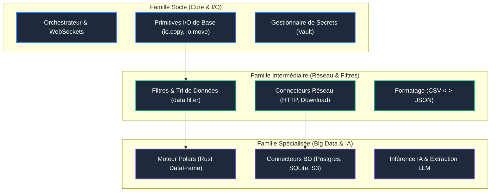

<!-- [WFGY] Zone: SAFE | λ: 0.1 | Action: Creation de la feuille de route des modules -->

# Feuille de Route des Modules (WFGY-Core)

Cette feuille de route organise le développement et l'intégration des modules (primitives) du moteur ETL modulaire par grandes familles de fonctionnalités, de l'infrastructure de base aux extensions analytiques avancées.

---

## 1. Famille Socle (Core & Infrastructure de base)

*Objectif : Assurer le fonctionnement de base du pipeline, la communication en temps réel et la sécurité des accès.*

| Module / Composant | Description | Primitives Cibles | Statut |
| :--- | :--- | :--- | :--- |
| **Moteur d'Orchestration** | Cerveau Python gérant la lecture, l'ordonnancement du DAG et la sauvegarde des Recettes. | `core.orchestrator` | **Opérationnel** |
| **Communication Temps Réel** | Streaming d'état bidirectionnel via WebSockets vers le Workbench. | `core.websocket` | **Opérationnel** |
| **Sécurité (Secrets Vault)** | Résolution dynamique des placeholders `${SECRET_XXX}` sans fuite dans les JSON. | `core.vault` | **Opérationnel** |
| **Gestion Fichiers de Base** | Opérations de manipulation de fichiers locales basées sur le binaire Rust. | `io.copy`, `io.move`, `io.metadata` | **Opérationnel** |
| **Éditeur Interactif UI** | Modification manuelle des briques du workflow et de leurs arguments directement via l'interface graphique (clic / formulaire). | `ui.editor` | **Planifié (Basse priorité)** |

---

## 2. Famille Intermédiaire (Réseau & Transformations Simples)

*Objectif : Étendre les capacités de transfert vers le réseau et permettre des premières transformations de flux sans dépendance lourde.*

| **Connecteurs Réseau standard** | Récupération et dépôt de ressources via protocoles web. | `net.http_request`, `net.download`, `net.upload` | **Opérationnel** |
| **Filtrage et Alignement** | Filtres conditionnels simples basés sur des critères de colonnes ou regex. | `data.filter`, `data.search` | **Haute** |
| **Convertisseurs de Format** | Changement de format à la volée (ex: CSV vers JSON pour streaming). | `data.csv_to_json`, `data.json_to_csv` | **Moyenne** |
| **Résolution interactive** | Primitives de gestion interactive des conflits étendues (Overwrite, Skip, Backup). | `io.resolve_conflict` | **Moyenne** |

---

## 3. Famille Spécialisée (Analytique, Big Data & IA)

*Objectif : Traiter d'importants volumes de données de manière hautement performante et intégrer de l'intelligence dans les flux.*

| **Moteur Analytique (Rust Polars)** | Opérations de DataFrame hautes performances (jointures, agrégations, groupby) en Rust. | `data.groupby`, `data.join`, `data.aggregate` | **Opérationnel** |
| **Intégration Stockage & Database** | Lecture et écriture directes depuis/vers des bases de données SQL ou du stockage objet. | `db.query`, `db.sqlite`, `db.s3_sync` | **Moyenne** |
| **Transformateur XML Avancé** | Transformations structurales complexes XML via feuilles de style XSLT. | `data.xml_transform` | **Basse** |
| **Inférence IA / NLP** | Intégration de tâches d'extraction d'entités ou de résumé de texte dans le DAG de données. | `ai.summarize`, `ai.extract` | **Basse** |
| **Exécution Parallèle** | Parallélisation des étapes indépendantes du DAG au niveau de l'orchestrateur. | `core.parallel_exec` | **Moyenne** |

